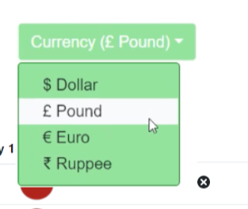

# coding-project-template
<!-- when you run `npm install -s`, it will install and save those packages. -->
### This is a fork project for ibm developer skills course on coursera, the function of this app is as follows:
1. Has editable budget field with increasing and decreasing value by 10;
2. You cannot increase the budget more than 20000;
3. You cannot decrease the budget less than spending;
4. Dropdown to change currency;
5. Accepts only numbers in the allocation field;

### To do:
To refine the currency change field, make it look more like this one, if you have any idea, feel free to share it with me:)

